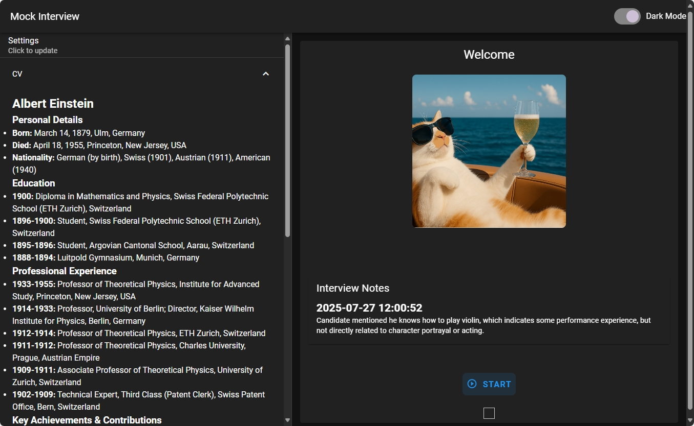

# Mock Interview Simulator
Real-Time Voice Interview Simulation Using Gemini Live API.

## Get Started
Create a file named .env in the project's root directory. Add your Gemini API key to this file:
```bash
GEMINI_API_KEY="YOUR_API_KEY_HERE".  
```
Make the script executable, build and launch the FastAPI application.
```bash
chmod +x run.sh
./run.sh
```

You can then access the application in your web browser at `http://localhost:8000`.

## Key Features

- **Realistic Voice Interaction:** Engage in natural, real-time conversations with an AI interviewer.
    
- **Dynamic Feedback:** Receive detailed notes on your responses.
    
- **Personalized Scenarios:** Customize the interview by providing your own resume (CV), a specific job description, and choosing an interview style (e.g., behavioral, technical, friendly).
    

