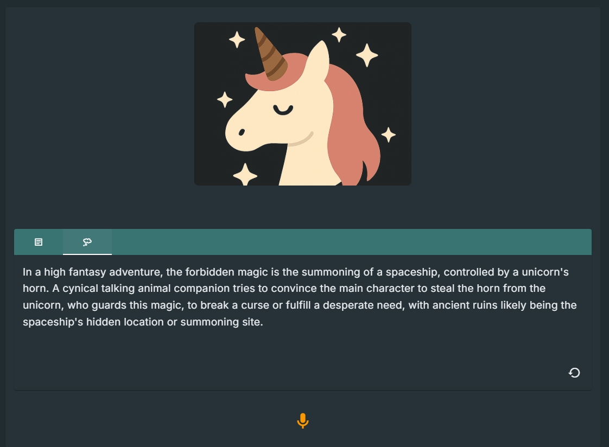
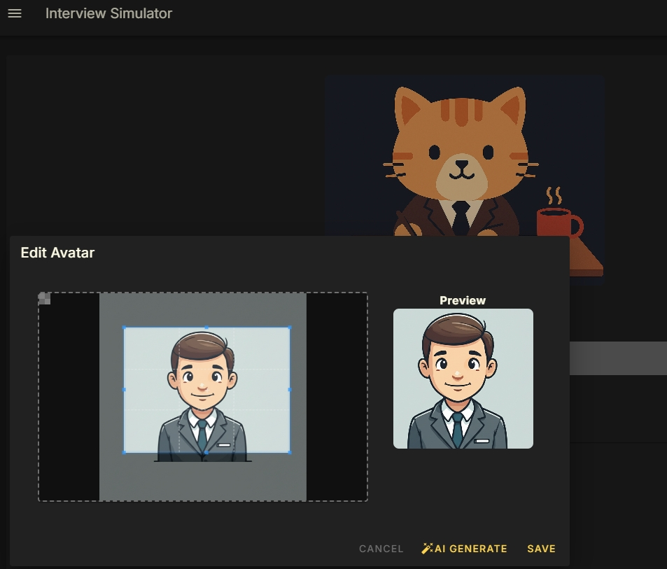
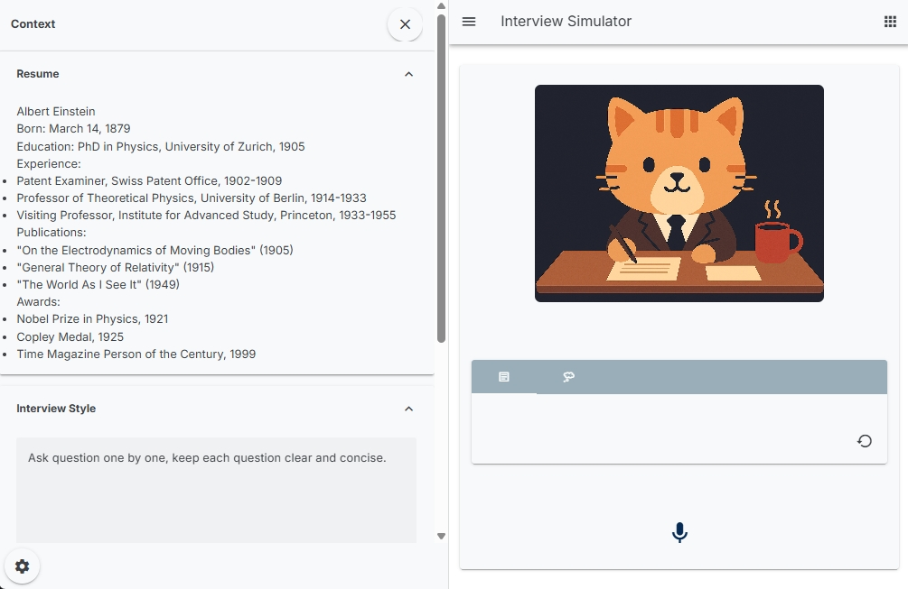
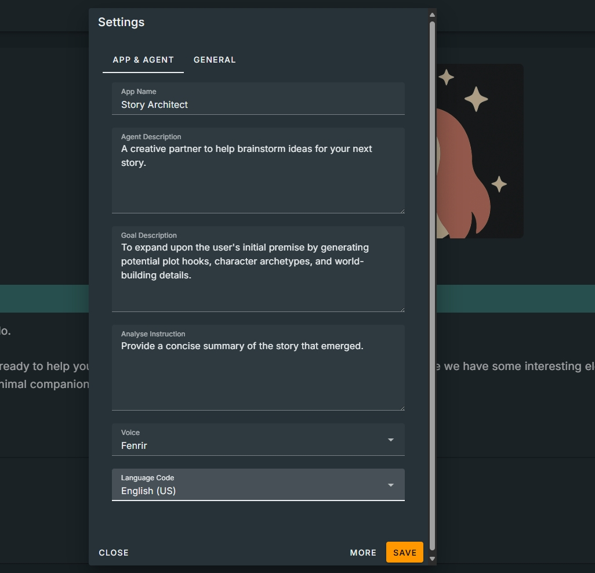
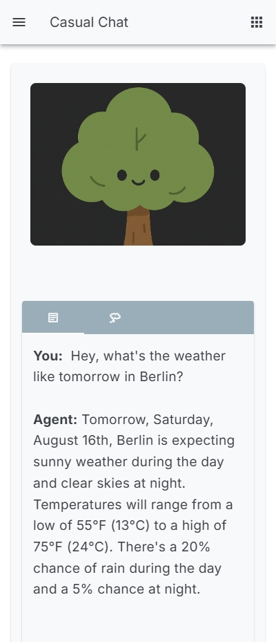

# Vox Hub: Echo Your Ideas

[](https://www.python.org/versions/3.12/)
[](https://vuejs.org/)
[](https://opensource.org/licenses/Apache-2.0)


Try it here: https://vox-hub.onrender.com/


## Features

*   **Live Transcription:** Get real-time transcription of your conversation.
*   **Post-Conversation Analysis:** Receive a Summary or Analysis of the entire conversation.
*   **Customizable Avatars:**  Generate a unique AI avatar with a single click, tailored to your chosen scenario.
*   **Internet Search:** Grant the agent the ability to search online for real-time information.
*   **Configurable Scenarios:** Easily customize the agent's role, personality, and context by editing a single JSON file. Explore different use cases in the `app_settings/` directory.

### Live Transcription


### Post-Conversation Analysis


### Customizable Avatars


### Configurable Scenarios
     

  

### Internet Search


## Getting Started

Follow these steps to get Vox Hub up and running on your local machine.

### Prerequisites

*   Python 3.12 or later
*   [uv](https://github.com/astral-sh/uv) (a fast Python package installer)

### Installation

1.  **Clone the repository:**

    ```bash
    git clone https://github.com/xiaowen2025/vox-hub.git
    cd vox-hub
    ```

2.  **Make the run script executable:**

    ```bash
    chmod +x run.sh && sh run.sh
    ```

3.  **Build and launch the application:**

    ```bash
    ./run.sh
    ```

    This script will:
    *   Create a virtual environment.
    *   Install the required Python and Node.js dependencies.
    *   Start the backend and frontend servers.

4.  **Access the application:**

    Open your web browser and navigate to `http://localhost:8000`.

## Configuration

To customize the AI agent, you can modify the JSON configuration files located in the `app_settings/` directory. These files allow you to define the agent's personality, role, and the context of the conversation.

For example, to start a new chat with the "Story Architect" persona, you can use the `story_architect.json` file.

## License

This project is licensed under the Apache 2.0 License. See the [LICENSE](LICENSE) file for details.