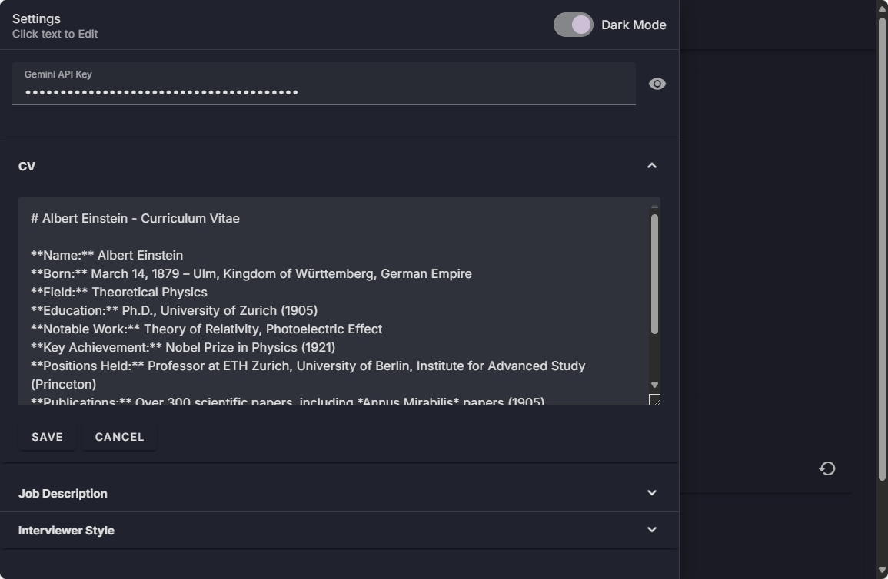
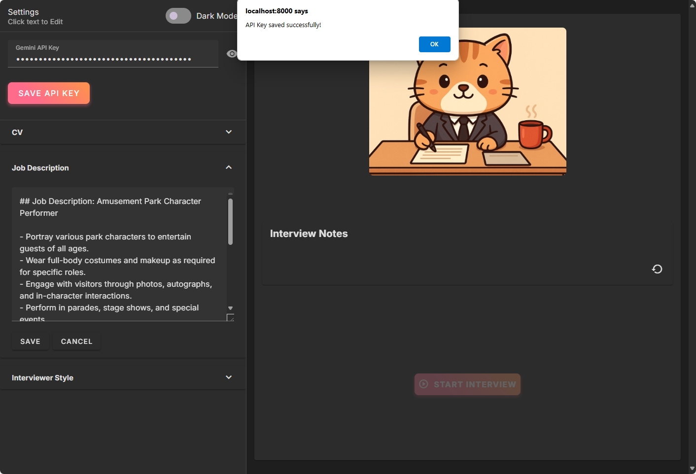
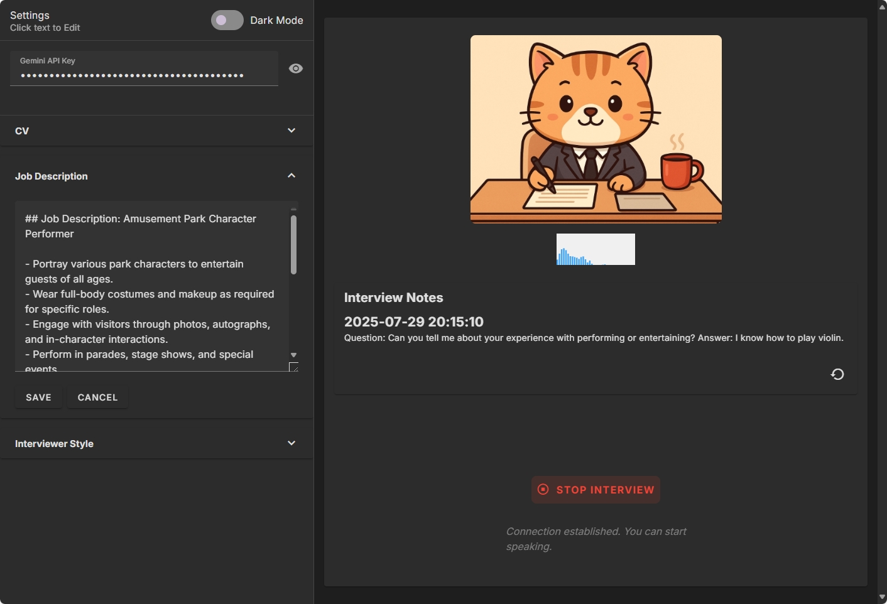
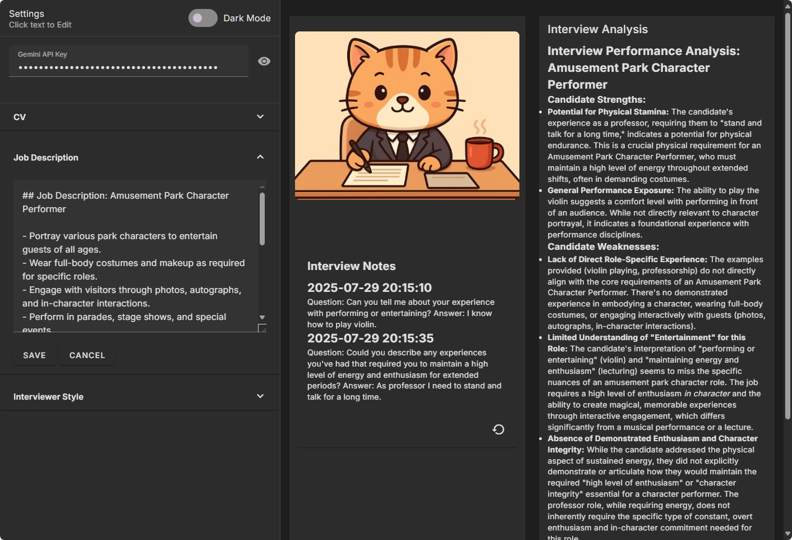

# Interview Simulator

The Interview Simulator is packed with features to provide a realistic and helpful interview experience.

### 1. Initial View

When you first launch the application, you will see the main interface.

### 2. Edit Context

You can customize the interview by editing the context. This includes providing your CV, the job description, and the role you are interviewing for. Click on the editable sections to modify them.

### 3. Save API Key

To use the application, you need to provide a Gemini API key. You can save your API key in the settings sidebar.

### 4. Interview Notes

During the interview, the AI will take notes based on your responses. These notes are displayed in real-time.

### 5. Display Analysis

After the interview is complete, you will receive a detailed analysis of your performance. The analysis is presented in markdown format for easy reading.

